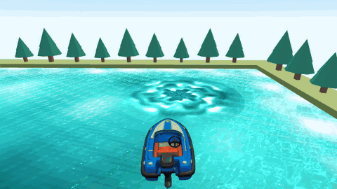
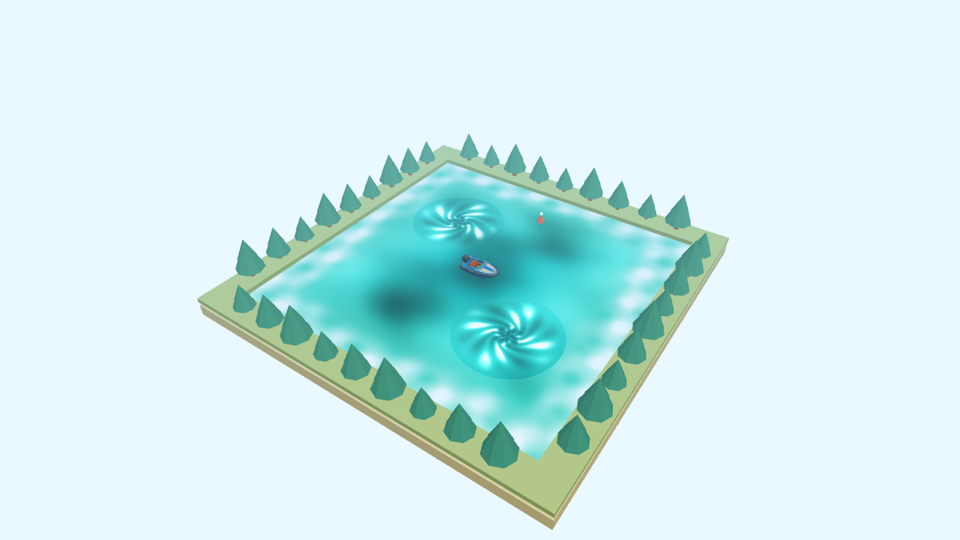
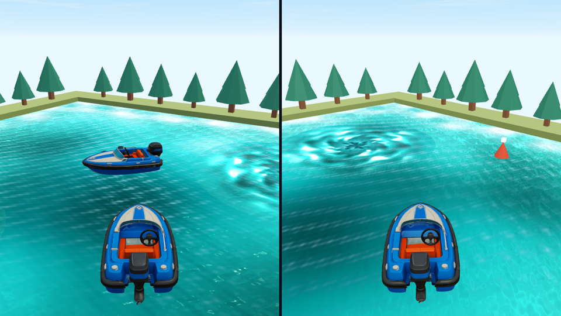
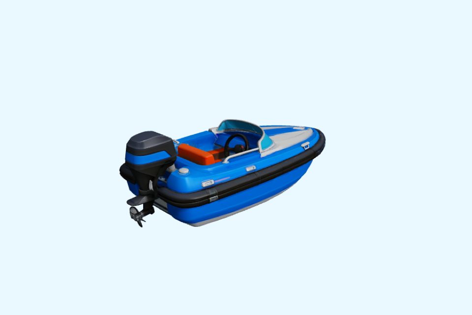

# Joyframe KMP

A Kotlin Multiplatform toolkit for 3D games: rendering, cameras, controllers, split screen,
audio and smoothness fixes from one `commonMain`, on desktop, Android, iOS and the browser.
It came out of a boat game, but almost nothing in it is about boats.



**Experimental 0.1.0-alpha04.** Extracted from a shipping arcade boat game, but this
standalone library is new: the original app's device coverage does not transfer
automatically. Not yet on Maven Central. **Try it in the browser:**
[rehaancubess.github.io/joyframe-kmp](https://rehaancubess.github.io/joyframe-kmp/).

## Why it exists

We built an arcade boat game in Kotlin Multiplatform and spent most of our time making it run
smoothly everywhere. Sound alone cut an iPhone 15 Plus from 59.5 to 53.5 fps with 9% late frames,
until every native audio call moved off the game thread. A mid-range Android phone reported a
steady 60 while the game ran at 39, with frames up to 350 ms. Couch play meant split screen, four
different controller stacks, phones as controllers and tilt steering, each behaving differently per
platform. Joyframe is those fixes, measured and pulled out of the game. [The full story](docs/why.md).

## For any 3D game, not just boats

Almost none of those fights were about boats. Any 3D game with sound stutters the same way, any
Android GL game can hide the same 39 fps, any follow camera jitters over a fixed-step simulation,
and any local multiplayer game meets the same split-screen and controller problems. The water,
buoyancy and whirlpools are the only boat-flavoured parts, and they are optional.

| What we fought | Where Joyframe solves it | Helps |
| --- | --- | --- |
| Sound stuttering the game | `AudioPlayer`, `MusicPlayer` | Every game with sound |
| Android at 39 fps while showing 60 | Android `GameView`, `GameViewOptions` | Every 3D game on Android |
| Phones shading pixels nobody sees | Resolution caps in `GameViewOptions` | Every 3D game on phones |
| "It feels laggy" with no numbers | `FramePacing` | Every game |
| A follow camera that jitters | `ChaseCamera`, `FixedTimestep` | Racers, third-person, anything that chases a player |
| Split screen per platform | `SplitGameView`, `SplitLayout` | Couch co-op and versus |
| Four controller stacks, players losing seats | `PlatformGamepad.pollAll`, `GamepadSeats` | Every controller game |
| Tilt steering that drifts or inverts | `DeviceTilt` | Racing, rolling-ball, flying |
| Blank canvas in browsers, misplaced views on Mac | Browser and macOS view hosts | Every Compose + 3D app |
| Checking a change without a phone | `OffscreenRenderer`, JVM tests | Every project, especially AI-assisted |

Good fits: kart and vehicle racers, arena brawlers, marble and physics toys, tank and ship games,
low-poly exploration, puzzle and board games in 3D, model viewers and store screens. One honest
limit today: models are static (no skeletal animation), so games built around animated characters
need something more.

## Built for vibe coding

If an AI assistant writes much of your game, Joyframe is designed for how that goes wrong:

- **All code, no editor.** Scenes are Kotlin data your assistant can read, write and diff.
- **The obvious code is the fast code.** Audio never blocks the game, Android draws on its own
  thread, phones get measured resolution caps. Naive code still runs smoothly.
- **It can check its own work.** Render any frame to a PNG without a window, read smoothness as
  numbers with `FramePacing`, and unit-test gameplay helpers on the JVM in seconds.
- **It ships the rules.** [`AGENTS.md`](AGENTS.md) tells coding assistants the conventions and pitfalls.

More in [vibe-coding.md](docs/vibe-coding.md).

## How it compares

Among Kotlin options, Joyframe is the one that puts a 3D game inside a Compose Multiplatform app on
iOS (Metal), Android, desktop and the browser from one `commonMain`. Kool has richer rendering but no
iOS; KorGE is 2D-first with experimental 3D; libGDX is not Kotlin Multiplatform. If you need physics,
skeletal animation or an editor, pick something else - see the [fair comparison](docs/comparison.md).

## What is included

**Rendering**
- One scene/mesh/material API with desktop OpenGL, Android GLES3, browser WebGL2 and
  iOS Metal backends, shown by a Compose `GameView`.
- Static GLB loading, directional shadows, transparency and stylized water, plus CPU
  water height/slope queries that match the shader exactly.
- `SplitGameView`: up to four player panes in one GPU surface (split screen).
- `ChaseCamera`: the source game's damped chase framing, speed-widened lens, cuts and shake.
- Whirlpool funnels, and `Weather` (snow, rain, blowing sand) that follows the camera.
- `ModelTurntable` for character-select or store screens; `OffscreenRenderer` on macOS
  for screenshots and GIFs.

**Smooth by default**
- `GameViewOptions`: the game's measured defaults - 0.8 render scale on Android, a 1920-pixel /
  2.07-megapixel cap on phones and browsers, 60 Hz on 120 Hz Android panels, sustained performance
  mode - and a decoupled Android render thread.
- `FramePacing`: fps, late frames, p95/p99 and worst frame from the loop that advances your game.

**Gameplay helpers**
- `FixedTimestep`: constant-rate physics with interpolated drawing.
- `Buoyancy.pose`: hulls pitch, roll and heave on the same swell the water draws.
- `Whirlpool`: pull, swirl and swallow, matching the drawn funnel.

**Input**
- Keyboard, touch stick and controllers combined into one `ActionInput` per player,
  with `drive` (steer + throttle, triggers included) and `movement` (direction).
- Every connected controller (`PlatformGamepad.pollAll()`), with all buttons, both
  sticks and both triggers, and stable local-player `GamepadSeats`.
- `KeyBindings.Wasd` / `KeyBindings.Arrows` for two players on one keyboard.
- `DeviceTilt`: steer by rolling the phone, on Android, iOS and phone browsers.

**Audio**
- Scene-owned `AudioPlayer` banks with readiness/failure state and clean disposal.
- Stereo pan and distance fade (`SpatialMix`, `camera.hear(position, range)`).
- `MusicPlayer`: a looped track on its own channel with volume and fades.

No game assets, accounts, server, analytics, purchases or credentials are included.
This is a toolkit, not an engine or editor: you own the game loop and the rules.

## Lake Lab

The sample is a small lake you can sail, in three modes:

- **Lake**: switch between the overview and the game's chase camera (C or controller Y).
  Toggle whirlpools, weather, a bell buoy you can locate by ear, and generated music.
- **Split screen**: two boats, two chase cameras, one surface. Player one uses WASD +
  Space or controller one; player two uses the arrows + Enter or controller two.
- **Hangar**: the boat on a turntable.

| Overview | Split screen | Hangar |
| --- | --- | --- |
|  |  |  |

Every sound, including the music, is generated in code. The screenshots use a local
boat model; the public sample ships a procedural boat (see below).

Requires JDK 17, an Android SDK with platform 36 (Gradle configures the Android
library), and OpenGL 3.3 / macOS OpenGL 4.1.

```sh
export ANDROID_HOME=/path/to/android-sdk
./gradlew :sample:run                              # desktop
./gradlew :sample:wasmJsBrowserDevelopmentRun      # browser
./gradlew :sample-android:assembleDebug            # Android APK
```

| Platform | Run it |
| --- | --- |
| macOS, Linux | `./gradlew :sample:run` |
| Windows | `./gradlew :sample:windowsJar`, then `java -jar LakeLab-windows-x64.jar` (Java 17+) |
| Android | `./gradlew :sample-android:assembleDebug`, then install the APK |
| iOS simulator | `tools/ios-simulator/run.sh` |
| Browser | `./gradlew :sample:wasmJsBrowserDevelopmentRun`, or the live demo above |

To sail your own model locally, pass `-Pjoyframe.demoBoat=path/to/boat.glb` (bow along
+Z). The file is staged only in ignored build output, never in the repository. See
[sample hosts and test checklist](docs/showcase.md), including the iOS entry point.

## Use it

```sh
./gradlew :joyframe:publishToMavenLocal
```

Enable `mavenLocal()` in your repositories and add to `commonMain`:

```kotlin
implementation("io.github.rehaancubess:joyframe:0.1.0-alpha04")
```

These coordinates are a **local build**, not a published Central release. iOS
artifacts must be built on macOS with Xcode. The browser target is Kotlin/Wasm.

```kotlin
val session = GameSession()
val fixed = FixedTimestep()
val chase = ChaseCamera()
val audio = AudioPlayer(mapOf(horn to PcmSound.tone(220f, .25f)))

// Once per frame:
val step = session.step(frameNanos, PlatformGamepad.poll())
repeat(fixed.advance(step.deltaSeconds)) { boat.tick(step.input.drive, fixed.stepSeconds) }
val camera = chase.update(boat.position, boat.forward, boat.speed, step.deltaSeconds)
if (GameAction.Interact in step.input.pressed) audio.play(horn)

// In Compose, with a scene built from your own assets:
GameView(assets.frame(camera, step.seconds) {
    instance("boat", "boat", Buoyancy.pose(water, boat.x, boat.z, boat.yaw, step.seconds),
        kind = InstanceKind.Dynamic)
}, Modifier.fillMaxSize(), active = session.active)
```

Imports are under `io.github.rehaancubess.joyframe`: `audio`, `input`, `render`,
`render.gpu`, `render.gltf`, `render.math` and `render.water`. The
[quickstart](docs/quickstart.md) covers every feature above with runnable snippets.

On Android, initialize `JoyframeAndroid` with the application context before creating
audio, and forward controller events from the Activity. Browser audio needs a user
gesture. Read [platform setup and limitations](docs/platforms.md) before integrating.

## Development

```sh
./gradlew :joyframe:desktopTest :sample:desktopTest
./gradlew :joyframe:compileDebugKotlinAndroid :joyframe:compileKotlinWasmJs
# macOS + Xcode:
./gradlew :joyframe:compileKotlinIosSimulatorArm64 :joyframe:compileKotlinIosArm64
# Consume the package without a project dependency:
./gradlew :joyframe:publishAllPublicationsToStagingRepository
./gradlew -p consumer-check test
# Offscreen stills and animation frames (macOS):
./gradlew :sample:captureDemo
```

[Architecture](docs/architecture.md) · [What was verified](docs/verification.md) ·
[Device testing](docs/device-testing.md) · [Publishing](docs/publishing.md) ·
[Contributing](CONTRIBUTING.md) · [License](LICENSE)
